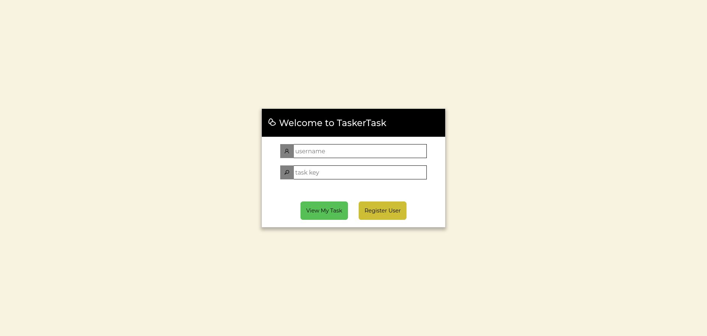
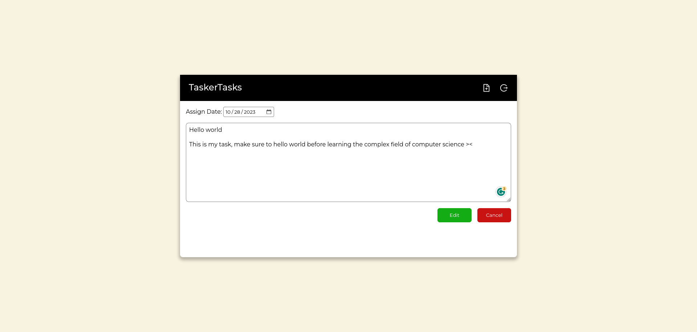
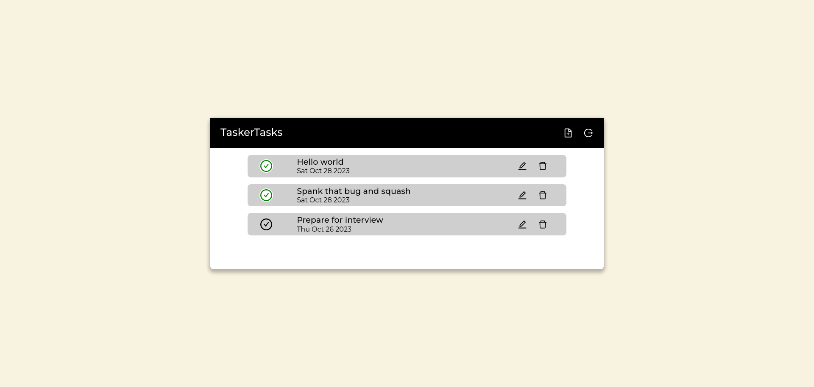

# TaskerTask
My first day's hands-on project for React TS. This web app is designed to save tasks and track the local users via their usernames. This web app uses *local storage* to store the username and tracking tasks for the specific user. The implementation of this with a working API backend will be added soon in a separate repository.

Another purpose of this single-page app is to simulate local separation of access between users' data and ensure the access is specifically only for the user account through xor encryption (although yes, xor encryption is a weak encryption, I like to make it simple).

## Web App UI
login panel


edit task


preview tasks


## Functionalities
- [x] Add task
- [x] Edit tasks
- [x] Set date for each task
- [x] Delete task
- [ ] Local notification

## Built using
- HTML
- CSS
- [Vite](https://vitejs.dev/)
- [React TS](https://react.dev/)

## Setup and Installation
Run the following commands to download and set up the web app:
```
git clone https://github.com/hubymeme22/taskertask.git
cd taskertask
npm install
npm run dev
```
